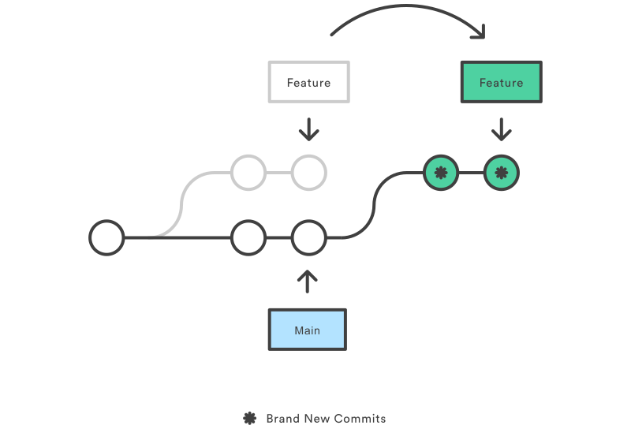

# Day 1: Advanced Git and GitHub Workflows

- [Day 1: Advanced Git and GitHub Workflows](#day-1-advanced-git-and-github-workflows)
  - [Objectives](#objectives)
  - [Topics Covered](#topics-covered)
  - [Learning Plan (1-2 Hours)](#learning-plan-1-2-hours)
    - [Introduction](#introduction)
    - [Advanced Git Commands](#advanced-git-commands)
    - [Branching Strategies](#branching-strategies)
    - [Collaborating on GitHub](#collaborating-on-github)

## Objectives
- Understand and apply advanced Git commands.
- Learn branching strategies and how to manage complex workflows.
- Practice collaboration using pull requests and code reviews on GitHub.

## Topics Covered
1. Advanced Git Commands
    - Rebasing
    - Cherry-Picking
    - Stashing
    - Resetting
    - Reflog
2. Branching Strategies
    - Git Flow
    - GitHub Flow
    - Trunk-Based Development
3. Collaborating on GitHub
    - Pull Requests
    - Code Reviews

## Learning Plan (1-2 Hours)

### Introduction
- Brief overview of advanced Git commands and workflows (10 minutes).

### Advanced Git Commands
1. **Rebasing** (20 minutes)
    - Watch a tutorial or read documentation on `git rebase` and `git rebase -i`.
    - Practice rebasing a feature branch onto the main branch.
        ```sh
        git checkout -b feature-branch  # create and checkout to the new branch
        git checkout feature-branch     # checkout existent branch
        git add .
        git commit -m "Commit message for feature-branch"
        git push --set-upstream origin feature-branch   # git push and change up-stream to the tip of the new branch
        git rebase master   # change the base of the feature-branch to the tip of the master branch, while still keep the history commits
        git push origin --delete feature-branch         # push the change and delete the remote branch
        ```
    - Resolve the conflicts:
        ```sh
        # first, edit the conflict parts in IDE
        git add <resolved-files>    # stage the resolved files
        git rebase --continue
        git rebase --skip           # skip the conflict resolving (not recommend)
        git rebase --abort          # exit the rebase process and back to the original state
        ```
    - Interactive Rebase Example:
        ```sh
        git rebase -i HEAD~3
        ```
    - **Notes:**
        - `rebase`: imagine like changing the base of the feature 
        
        - `merge`: squash all the history commits if the branch into a merge commit in the base branch. There're 2 types of merge: fast-forward and 3-way merge.
        - fast-forward: if the base branch doesn't have any new commit, then `--ff-only` would move the HEAD to the tip of the feature branch. But this would fail if the base branch does have other commits after branch. Then we must use 3-way merge.
        
        - 3-way merge: create a merge commit and squash all changes of the destination branch to the merge commit.
        

2. **Cherry-Picking** (10 minutes)
    - Identify a commit from one branch and apply it to another branch.
        ```sh
        git checkout another-branch
        git cherry-pick <commit-hash>   # apply the change of this commit to the current branch
        ```
    - **Notes:**
        - Cherry-pick process:
        ```sh
        git log --graph --oneline --decorate --all  # list the history of the whole repo
        git cherry-pick <commit-hash>
        git add <resolved-file>
        git cherry-pick --continue                  # the 3 commands have the same use as git rebase
        git cherry-pick --skip
        git cherry-pick --abort
        ```
        - tips:
          - stash or backup before cherry-picking, especially when dealing with conflicts
          - use cherry-pick carefully as it could cause duplicated commits
          - test thoroughly afterward to make sure the intergration works well

3. **Stashing** (10 minutes)
    - Stash uncommitted changes and apply them later.
        ```sh
        git stash # save all your unstaged files in a temporary area and revert the workspace to the HEAD commit
        git stash -u                # stash untracked files
        git stash -a                # include all files, even ignored one
        git stash drop              # remove a stash
        git stash push <filename>   # stash the specified file
        git stash save "your message here"  # stash with a message
        git stash list              # list all stashes
        git stash pop               # apply the recent stash
        git stash apply stash@{2}   # apply the second stash in the list, if you have multiple stashes
        git stash branch <new-branch-name> stash@{0}    # create a new branch from a stash
        ```

4. **Resetting** (10 minutes)
    - Experiment with different reset options.
        ```sh
        git reset --soft <commit-hash>  # move the HEAD to the specified commit, and keep changes in the staging place and working area
        git reset --mixed <commit-hash> # move the HEAD as soft, update the staging area to match the commit but keep changes in the working area
        git reset --hard <commit-hash>  # does as soft, update the staging area, but reset the working directory to match the commit aka discard all local changes -> should stash beforehand
        ```
    - **Notes:**
        - be careful with `--hard` as it could lead to data loss
        - backup work with `git branch backup-branch`
        - `revert` would create a revert commit with the state of the specified commit, while `reset` change the HEAD pointer

5. **Reflog** (10 minutes)
    - After reset or do commands that remove the old commits, Git actually does keep your commits up to 90 days, but Git would hide it somewhere. `reflog` would help you to view them.
    - Use `git reflog` to recover a lost commit.
        ```sh
        git reflog                  # view repo log
        git reflog show <branch>    # view log of a branch
        git reflog show HEAD        # view the log of the HEAD pointer
        ```
    - **Notes:**
        - recover a commit in a reset or other action
        ```sh
        git reflog
        git checkout <commit-hash>
        ```
        - undo a reset or rebase
        ```sh
        git reflog
        git reset --hard <commit-hash>
        ```

### Branching Strategies
6. **Branching Strategies** (10 minutes)
    - Study different branching strategies
    - **Notes:**
        - Git flow: suitable for projects with scheduled releases and multiple environments (dev, staging, prod)
        
          - Key Branches: 
            - main branches (`main`, `release`): exist forever
              - `main`: Contains production-ready code.
              - `release`: Prepares for a new production release.
            - support branches (`develop`, `feature`, `hotfix`,...): will be deleted after PR is merged
              - `develop`: Contains code for the next release.
              - `feature`: Used for developing new features.
              - `hotfix`: Fixes urgent issues in production.

        - Github flow: simpler model than Git flow, focus on the CI feature, means that all the script in `master` branch should be deployable
        
          - Workflow:
            1. create feature branch 
            2. commit changes and push to Github
            3. create pull request on Github to merge the branch to the `master` branch
            4. review and merge the pull request into `master` branch
            5. deploy the `master` to prod

        - Gitlab flow: intergrate with Gitlab's CI/CD pipelines, suitable for multiple-environment projects
        
            - Key branches:
              - `main`: production code
              - `develop`: (optional) code for the next release
              - `staging`, `pre-prod`: match branches with deployment environments
              - `feature`: used for hotfixes or feature developments
            - Workflow:
              1. create and checkout `feature` branch
              2. commit change and push to gitlab
              3. create merge request -> review using CI flows and tools (depends)
              4. merge
              5. deploy to the corresponding environment

        - Trunk-Based Development: used for high-frequency deployments and small teams, a bit alike the github flow
        
            - Key branches:
              - `main`/`trunk`: long-live branch
              - others: used for small tasks and will be merge back to the `main` shortly
            - Workflow: the same as github flow, but the merge could happen several times a day

        - Release branching: used for projects with scheduled releases and multiple active versions
        
            - Key branches: 
              - `main`: production code
              - release branches: used for release versions (`release/1.0`, `release/1.1`,...)
            - Workflow:
                1. create a release
                2. develop and test and commit changes
                3. merge to `main` when ready for release
    => **Tips**: choose the suiltable flow based on the team's requirements: team size, plan to release,...

### Collaborating on GitHub
7. **Pull Requests** (10 minutes)
    - [x] Create a new repository on GitHub.
    - [x] Create a pull request and write a comprehensive description.

8. **Code Reviews** (10 minutes)
    - [x] Invite a collaborator to review your pull request.
    - [x] Review a collaborator’s pull request and provide feedback.
